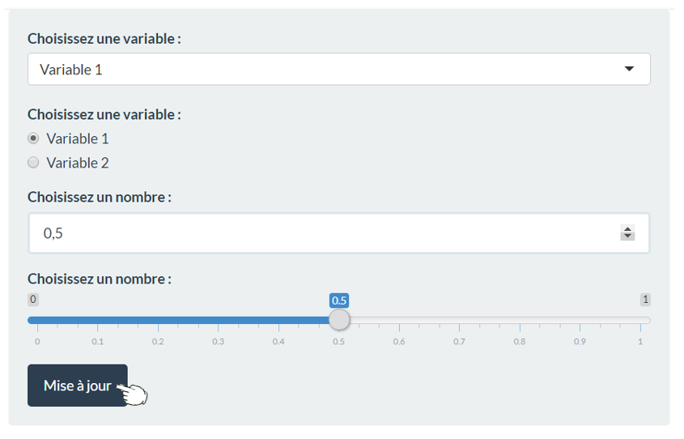

```{r setup, include=FALSE}
knitr::opts_chunk$set(echo = TRUE)
```


<br/>
<br/>

# Sommaire

<br/>

<h2> 1.	Préambule </h2>
<h3>    1.1.	Présentation de l’application </h3>
<h3>    1.2.	Notice d’utilisation à télécharger </h3>

<br/>


<h2>  2.	Base de données </h2>
<h3>    2.1.	 Présentation </h3>
<h3>   2.2.	Traitement </h3>

<br/>


<h2>  3.	Support Vector Machine </h2>
<h3>   3.1.	Principe </h3>
<h3>    3.2.	Démonstration et Comparaison </h3>


# Navigation
## Onglets

<p>&nbsp;&nbsp;Afin de naviguer dans l'application, cliquez sur le nom de la partie puis de la sous-partie que vous souhaitez.</p>

<br/>
<div align=“center”>
<div markdown=“1”>


</div>
</div>


\newpage

## Paramètres à choisir
<p>&nbsp;&nbsp;Dans certaines parties de l’application, vous êtes invités à choisir des paramètres qui modifieront les sorties affichées. </p> 
<p>&nbsp;&nbsp;Afin de rendre cette interactivité la plus fluide possible, nous avons ajouté un bouton de mise à jour sur lequel il vous faudra cliquer pour activer le changement voulu des paramètres. </p>

<br/>

